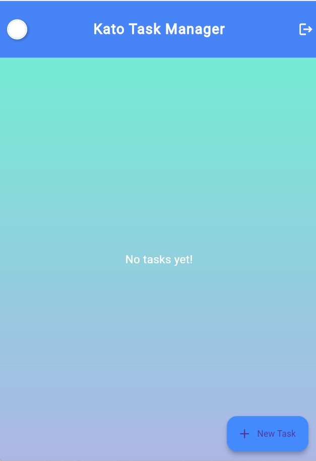
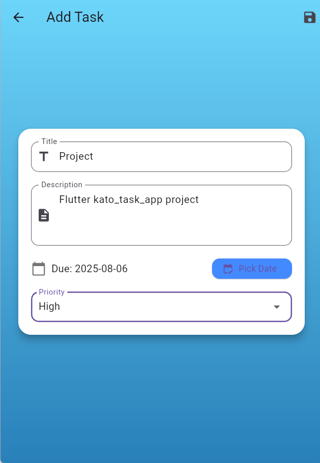
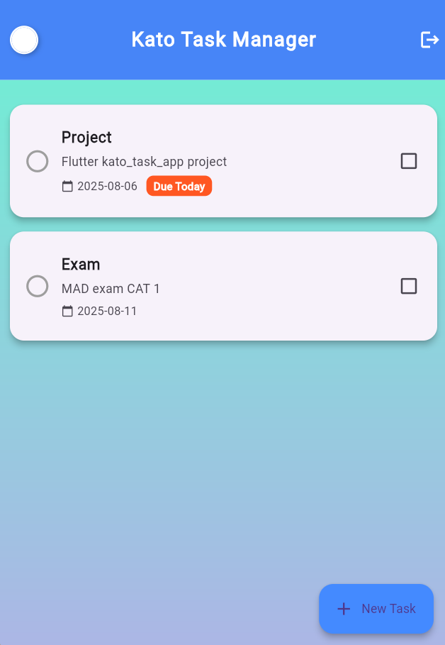
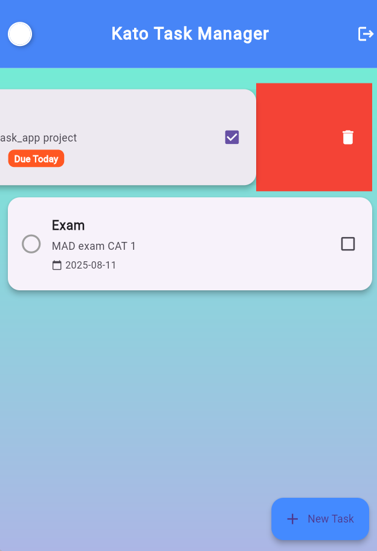

# 📝 Kato Tasks App

Kato Tasks App is a beautifully designed Flutter-based Todo Task Manager. It supports user authentication, animated task cards, due date alerts, and offline sync using Hive and Firebase.

---

## 🚀 Features

- 🔐 Google Sign-In (Firebase Authentication)
- 🧠 Beautiful UI with card layouts and icons
- 📆 Due Today badge & Calendar picker
- ✅ Mark tasks as completed
- 📝 Create, edit, and delete tasks
- ☁️ Sync tasks with Firebase (optional future scope)
- 📦 Local offline storage with Hive

---

## 📸 Screenshots

---

## 🎥 Download Demo Video
[Click to download](assets/screenrecord/demo.mp4)

---

## 🛠️ Tech Stack

- Flutter
- Firebase Authentication
- Hive (for local storage)
- Google Sign-In

---

## 📁 Folder Structure

lib/
├── models/ # Task Hive model
├── screens/ # Login, Task list, Edit task
├── firebase_options.dart
└── main.dart # App entry point

---

## 🧑‍💻 Developer

**Karthikeyan V**  
Final Year, B.Tech Information Technology  
Vel Tech Multi Tech Engineering College

---

## 🔗 GitHub Repository

[GitHub Repo](https://github.com/KarthikeyanV2005/kato_tasks_app)
